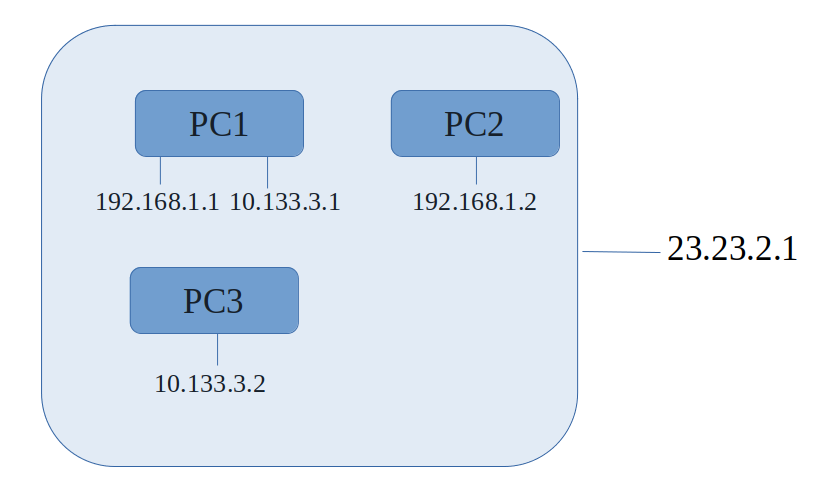

## webrtc 相关名词介绍

webrtc中有许多概念对于初学者来说会造成理解障碍，如果对这些概念没有一个大体的认识，即使这些概念不重要，仍旧会让初学者下意识认为这件事情很难。下面我用大白话简单描述以下这些经常触及的概念。

### SDP
就是一个协商协议，里面包含了是否需要建立数据通道、是否需要建立视频流、是否需要建立音频流，以及这些流的格式规范，比如视频编码格式是使用H264还是VP8，音频编码格式是否使用OPUS等。

如下便是一个仅仅建立数据通道的SDP的offer以及对应的answer。

#### offer

```shell
v=0
o=- 8382788528297067006 2 IN IP4 127.0.0.1
s=-
t=0 0
a=group:BUNDLE 0
a=msid-semantic: WMS
m=application 9 UDP/DTLS/SCTP webrtc-datachannel
c=IN IP4 0.0.0.0
a=ice-ufrag:c+zu
a=ice-pwd:jvxc6prZIswRtLdfjJI1GJV4
a=ice-options:trickle
a=fingerprint:sha-256 13:5F:AB:21:80:9F:24:69:48:53:FC:39:5A:A4:5E:FB:31:4B:26:6F:8E:6A:36:01:8F:12:81:F3:60:D8:B9:B3
a=setup:actpass
a=mid:0
a=sctp-port:5000
a=max-message-size:262144
```

#### answer

```shell
v=0
o=- 2411559430796177653 2 IN IP4 127.0.0.1
s=-
t=0 0
a=group:BUNDLE 0
a=msid-semantic: WMS
m=application 9 UDP/DTLS/SCTP webrtc-datachannel
c=IN IP4 0.0.0.0
b=AS:30
a=ice-ufrag:X4yB
a=ice-pwd:ik/QrqW5BOQwML43qbq9/mOo
a=ice-options:trickle
a=fingerprint:sha-256 C9:0D:5D:72:1F:A1:37:D4:06:7C:2C:A0:26:D1:ED:C9:EE:34:0D:EE:2E:05:D8:06:0B:43:66:0B:CC:2A:F0:12
a=setup:active
a=mid:0
a=sctp-port:5000
a=max-message-size:262144
```

初学者完全没有必要去纠结SDP中的每个字段是什么意思，以及它的具体格式是如何的。原因有两个：第一，这不是重点。第二，没有必要，因为这是标准格式，需要的时候再去专门阅读RFC文档。

只需要注意几个关键字段，比如：a=mid:0，这表示这是sdp里面的第一项，如果SDP中还有音频需要去协商，那么音频的那一段就是a=mid:1，如果还有视频，视频的那一段就是a=mid:2。

在比如： m=application 9 UDP/DTLS/SCTP webrtc-datachannel，它表示这是个数据通道，使用的是用户态SCTP协议，底下是DTLS加密的UDP协议。

主动方先通过webrtc的接口创建一个SDP出来，这个SDP就叫做OFFER。然后通过某些途径（公网转发服务器）将这个SDP传给被动方，被动方根据自己的实际情况应答这个OFFER，用来应答的SDP就叫做ANSWER。

在视频流那章中，我会继续举例。

### candidate

顾名思义candidate就是候选的意思，指的是可以用来建立网络连接的某个ip地址。



在上图中某个局域网下有3台PC，两个小子网段，这个局域网的公网IP是23.23.2.1。

webrtc在准备建立连接的过程中会去收集连接双方的candidate，我们以PC1和PC2建立连接为例，并且假设PC1和PC2创建的socket端口都是8888。

PC1和PC2会分别去收集自身的candidate，首先收集的局域网地址，PC1是192.168.1.1:8888\10.133.3.1:8888, PC2是192.168.1.2:8888。

每收集到一个candidate，PC1就会将这个candidate通过某些途径（公网转发服务器）发送给PC2。PC2也会将自己的cadidate发送PC1。

局域网地址收集完了后，就会去收集公网地址，webrtc是通过stun协议来干这个事情。简单点说，就是PC1发送一个UDP报文给公网上的stun服务器，然后stun服务器告诉PC1，在stun服务器这一端看到的PC1发出来的UDP报文的公网ip和端口号(假设是9999)。于是PC1就获取到了自己的外网candidate:23.23.2.1:9999。

于是PC1、PC2又会将外网candidate通告给对方。

在这个例子中，PC1和PC2处于同一个局域网下，当PC1拿到PC2的局域网cadidate:192.168.1.2:8888。PC1就会尝试与PC2的这个地址去通信（发送一个规定格式的报文）：

```shell
192.168.1.1:8888 ------> 192.168.1.2:8888    yes!
10.133.3.1:8888  ------> 192.168.1.2:8888    no!
```

同理当PC2拿到PC1的局域网cadidate后，也会执行这个动作。当PC1和PC2双向都通的时候，P2P连接就连接了，称为一个"connection"。

每收到一个对方的candidate，webrtc就会执行上述说的连通性测试，如果说后续又出现了可以连通的"connection"，webrtc会进行"connection"的切换，具体的方式是通过rtt来排序，不过多介绍了。

