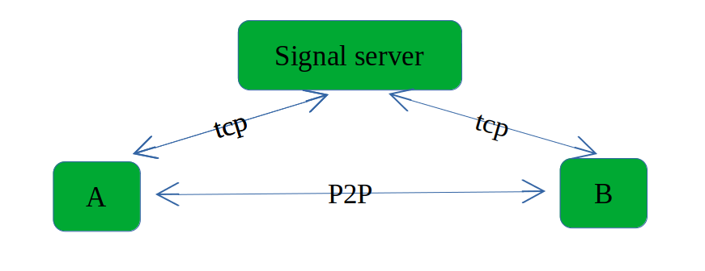

## webrtc 数据通道

在webrtc中除了传输音频、视频以外，还可以通过"datachannle"传输一些普通数据，比如二进制协议等。

除了介绍datachannle之外，本章重点在于描述webrtc"建立连接"的流程，并通过伪代码描述。

为了描述方便，这里我们假设有AB两个用户希望使用webrtc互连，由A主动发起建立连接的请求。没有视音频流，仅建立一个数据通道。

### 信令服务器

webrtc是点对点通信，旨在为两个位于不同网络下的webrtc客户端建立通信。在p2p连接建立之前，A并不知道B的任何情况。

webrtc需要借助一个AB双方都可以访问的第三方服务用来帮助AB交换信息，这个第三方服务就称为信令服务器。

webrtc没有对信令服务器做任何规范，使用者可以自由实现。不过通常信令服务器都采用websocket协议，以便与浏览器(javascript)建立连接。

这个结构是这样的:



### PeerConnection


可以通过如下的方式创建一个peerconnection:

```c++
auto factory = new PeerConnectionFacotry(params);
auto peer_connetion = factory->create_peer_connection(params);
```

毕竟webrtc是很庞大的一个现代C++工程，必然要使用某种设计模式来管理源码，工厂模式贯穿整个webrtc源码。

可以说webrtc向使用者提供的所有类、接口中，PeerConnection是最关键的类。

使用PeerConnection创建DataChannel，并且为这个DataChannel注册一个Observer:

```c++
auto data_channel = peer_connection.CreateDataChannel("data");      //line 1
auto observer = new Observer(); 
data_channel.RegisterObserver(observer);                            //line 2
peer_conection.RegisterObserver(observer);

class Observer {
public:
    void OnSuccess(SessionDescriptionInterface* sdp) {
        peer_connection.SetLocalDescription(observer, sdp);       //line3
        signal_server.send_to("B", sdp); //通过信令服务器告知对端本地sdp
    }
    void OnStateChange() {
        if(data_channel.state() == DataState::kOpen) {
            DataBuffer buf("hello,I'm A!");
            data_channel->send(buf);
        }
    }
}
```

当我们执行line1时，peerconnection就知道了需要创建一个datachannel，并在创建Offer的时候，在offer中写入"datachannel"。

```C++
peer_connection.CreateOffer(observer, options); //在offer中写入"datachannel"
```

当webrtc创建完offer之后，便会回调Observer.OnSuccess(sdp)。

在该回调中，用户执行SetLocalDescription(sdp)，正式将这个sdp作为"本地Description"，并且将这个sdp通过信令服务器发送
给对端。


这里我们忽略信令服务器转发这个过程，那么对于远端B，也需要创建一个peerconnection，当收到来自A的SDP之后将这个sdp作为
"远端Description"，并且回应给A一个Answer。

伪代码如下:

```c++
auto factory = new PeerConnectionFacotry(params);
auto peer_connetion = factory->create_peer_connection(params);

void OnRemoteSdp(webrtc::SessionDescriptionInterface* sdp) {   #line1
    peer_connection.SetRemoteDescription(observer, sdp);       #line2
    peer_connection.CreateAnswer(observer, options);           #line3
} 

class Observer {
public:
    void OnSuccess(SessionDescriptionInterface* sdp) {
        peer_connection.SetLocalDescription(observer, sdp);
        signal_server.send_to("A", sdp); //通过信令服务器告知对端本地sdp
    }
    //与A的数据通道opened之后的回调
    void OnDataChannel(rtc::scoped_refptr<DataChannelInterface> data_channel) {
        data_channel_ = data_channel;
        data_channel_->RegisterObserver(this);
    }
    void OnStateChange() {
        if(data_channel_->state() == DataState::kOpen) {
            DataBuffer buf("hello,I'm B!");
            data_channel->send(buf);
        }
    }
private:
    rtc::scoped_refptr<DataChannelInterface> data_channel_ = nullptr;
}
```

假设B收到来自信令服务器的消息(发自A的offer)会调用line1。通过line3创建对应的Answer,同样的，当这个sdp(answer)创建完之后，
webrtc会回调observer.OnSuccess(sdp)。

在该回调中，正式将这个sdp作为B的"local description"，并且将这个sdp通过信令服务器转发给A。

当A收到来自信令服务器的消息后，将B发送给自己的sdp，作为"remote description"。

```C++
void OnRemoteSdp(webrtc::SessionDescriptionInterface* sdp) {   #line1
    peer_connection.SetRemoteDescription(observer, sdp);       #line2
} 

```

到目前为止，offer\answer交互就已经全部完成了。接下来介绍candidate。

在应用层调用SetXXXDescription()时，webrtc便开始收集"**候选地址**"。

#### candidate(候选地址)

局域网下的主机A，本地具有2个网络设备：以太网和802.11(wifi)，ip分别是192.168.1.2\10.133.1.2，并且它的公网地址是200.100.50.1。那么理论上该主机A有拥有三个udp candidate，分别就是上述的三个地址。将一个candidate打印成字符串，长这样子：

``` shell
"candidate":"candidate:1779684516 1 udp 2122260223 192.168.29.185 56370 typ host
generation 0 ufrag 7XGL network-id 1","sdpClientType":"cpp",
"sdpMLineIndex":0,"sdpMid":"0","type":"candidates"
```

type=host标识这是个本地candidate，ip是192.168.29.185。

每收集到一个candidate，webrtc会回调OnIceCandidate，这时候应用层就需要将这个candidate发送给对端:

```c++
class Observer {
public:
    void OnIceCandidate(const webrtc::IceCandidateInterface* candidate) {
        signal_server.send_to("B", candidate); //通过信令服务器告知对端我们的candidate
    }
```

当某一端收到来自对端的candidate之后，需要将这个candidate告诉webrtc:

```c++
auto peer_connetion = webrtc::PeerConnectionInterface();
class B {
    void on_recv_candidate(const webrtc::IceCandidateInterface* candidate) {
        peer_connection.AddIceCandidate(candidate);
    }
}
```

紧接着，webrtc会将本地candidate和远端candidate做一个匹配，创建虚拟的连接(**connection**)。

#### connection

某一个局域网下的主机A只有一个网络设备，本地ip是192.168.1.2，它的外网地址是123.1.1.2。

另一个局域网下的主机B只有一个网络设备，本地ip是10.133.1.2，它的外网地址是200.1.1.2。

当B的2个candidate(本地和外网)发给A之后，A就会创建如下的**connection**:

* 192.168.1.1 <-> 10.133.1.2
* 192.168.1.1 <-> 200.1.1.2

**connection** 是一个虚拟的”连接”，作为一个可能可以连通的候选。

webrtc会对所有connection进行连通性检测，类似于"ping"，能"ping"通则说明网络能通，并对所有的"connection"进行排序，选择出最好的那个connection(rtt最短)，并用于最后的流媒体传输。


### Datachannle的回调

在这之后，dtls握手就会进行，再紧接着，用户态的sctp协议握手进行，数据通道就建立好了。

对于主动创建datachannle的一方（A），webrtc会通过OnStateChange(state)回调告诉使用者。

对于B，webrtc会通过OnDataChannel(channle)回调告诉使用者。


### 可编译运行的C++示例

在src/datachannel/main.cpp中，我创建了2个peerconnection，作为主动方和被动方。

示例的主要目的是展示webrtc的交互流程，所以忽略了信令服务器转发这个动作，直接让另一方使用了sdp、candidate:

```C++
    virtual void OnSuccess(webrtc::SessionDescriptionInterface* desc) override {
        peer_connection_->SetLocalDescription(DummySetSessionDescriptionObserver::Create(), desc);
        
        //需要将sdp转为字符串，由信令服务器转发
        std::string sdp_str;
        desc->ToString(&sdp_str);
        /* sending sdp to remote...
         * ----------------------------------------> 1 ms
         * ----------------------------------------> 2 ms
         * ....
         * ----------------------------------------> 1/2 rtt
         */
        //接收端需要将字符串重新转为sdp
        auto sdp_cp = webrtc::CreateSessionDescription(desc->GetType(), sdp_str, nullptr);
        other_->received_sdp(sdp_cp.release());
    }
```

虽然A、B同在一个进程，但是仍旧是正常的两个独立的webrtc客户端，但愿这样不会给读者造成困惑。

以上便是一个正常的webrtc连接的过程。

**完整源码**

https://github.com/MemeTao/webrtc-native-samples/blob/master/src/datachannel/main.cpp
