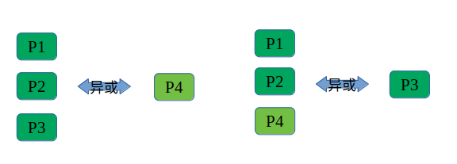
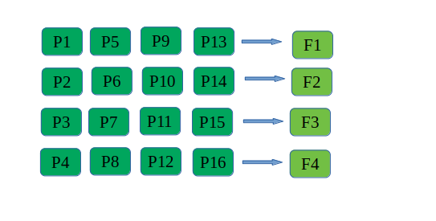

## webrtc FEC机制

主要介绍下webrtc中的FEC原理和大致流程。

### FEC原理

FEC的意思是"前向纠错"。通过一定的冗余信息来恢复错误。



上图中，发送方通过将三个包异或产生出第四个包，并将这4个包一起发送给接收方。假设在这过程中4个包中的某一个丢失，则仍旧可以根据剩下的3个包恢复出丢失的那个包。

在上述的例子中，冗余度度是33%，也就是3个包产生一个冗余包。如果这时候的丢包率小于25%（4个包丢一个包），FEC就能发挥作用。

### FEC在webrtc中的实现

webrtc处理丢包的措施主要是靠重传，当RTT>20ms并且有丢包，这时候会同时使用FEC和重传来对抗丢包。

webrtc 通过两个类来实现FEC，分别是FecController和FecGenerator。前者主要是根据当前的RTT、丢包率来决定FEC的冗余度，后者主要是根据前者的冗余度来和应用层输入的视频数据执行FEC算法产生冗余包。 代码分别是modules/video_coding/fec_controller_default.cc、modules/rtp_rtcp/source/flexfec_sender.cc。

#### 冗余度的计算

比较复杂，[参考链接](https://www.jianshu.com/p/7fb9d640a998 "冗余度的计算")

计算的结果会落在[20%,50%]内。


#### 冗余包的产生

一个视频帧经过RTP打包后会形成若干个RTP媒体包，这些RTP包都会送到FecGenerator中。通常情况下，FecGenerator会对每一帧视频进行FEC，产生冗余包。当媒体包个数小于等于12个时，采用固定的查表方式来确定分组形式。大于12个时，使用取余的形式来确定分组形式。

#### 查表确定分组

当媒体包数量小于等于12时，webrtc通过内置的2张静态掩码表来确定分组形式，分别是"随机丢包表"和"突发丢包表"。

这张表的结构如下:
```c++
#define kMaskBursty10_7 \
  0x30, 0x00, \
  0x18, 0x00, \
  0x0c, 0x00, \
  0x07, 0x00, \
  0x81, 0x40, \
  0xc0, 0x80, \
  0x60, 0x40
```

这个示例是"突发丢包表"的第10个表目的第7项。在媒体包个数是10个，冗余包个数是7时，webrtc就会使用这个表目。

* 0x30,0x00 -> 0011 0000 0000 0000，第1个冗余包由第3、4媒体包异或产生
* 0x18,0x00 -> 0001 1000 0000 0000，第2个冗余包由第4、5媒体包异或产生
* ....
* 0x60,0x40 -> 0110 0000 0100 0000，第7个冗余包由第2、3、10媒体包异或产生

```c++
#define kMaskRandom6_2 \
  0xa8, 0x00, \
  0xd4, 0x00
```

这个示例是"随机丢包表"的第6个表目的第2项。在媒体曝个数是6个，冗余包个数是2时，webrtc就会使用这个表目。

* 0xa8,0x00 -> 1010 1000 0000 0000，第1个冗余包由1、3、5媒体包异或产生
* 0xd4,0x00 -> 1101 0100 0000 0000，第2个冗余包由1、2、4、6媒体包异或产生

**目前的webrtc(M83)仍旧没有实现如何识别随机丢包和突发丢包，默认使用随机丢包模式**。

#### 取余确定分组

当媒体包的数量大于12时，webrtc是通过简单的取余方式确定分组形式。



上图中，当媒体包的个数是16时，假设冗余度是25%，需要产生4个冗余包。

运气好的情况下，假设这个20个RTP包丢了1\2\3\4号包，那么可以通过FEC恢复出来。
