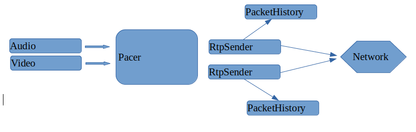

## webrtc 网络传输---丢包重传

主要介绍在webrtc发包的过程以及如何处理重传请求。

### 发包

webrtc中主要有两个发送源：音频流和视频流。当"流"中有数据时又会调用"发送"接口，Rtp打包以后，就会将所有的Rtp包放到Pacer的"优先级队列"中，由Pacer统一管理，并决定在什么时间点发送这个包。

Pacer每次都会从队列中取出若干Rtp包，由包头的ssrc标识找到该包的"Sender",并通过这个Sender将这个包发送到网络中去。每一个"Sender"中都会有一个"缓冲区(PacketHistory)",用来存放"可能需要重传的已发送数据"，**缓冲区的长度默认是600**。

### 收包 

webrtc接收端会根据Rtp包头的SSRC和PayloadType字段，判断出这个Rtp是音频还是视频，并将这个Rtp包交给对应的"接收流”。以视频为例，VideoReceiver中维护了一个PacketBuffer，用来存放"已到达但是还未完整"的视频帧。并且还有个专门负责"发送重传请求"的模块(Nack Module)。

### Nack模块

Nack模块有两个判断是否丢包的依据，需要同时满足:

* 包间隔 
* 时间差

所谓"包间隔"指的是包序号之间的距离。假设包间隔=5，如果出现以下情况就会触发Nack请求:

图示中，直到N+7号包达到的时候，N+2号包还未达到。

在Nack模块中，这个包间隔具体是多少是Nack模块1根据"直方图"去**统计过去一段时间**包乱序的情况后得到的一个最优估计，这里不过多介绍。

所谓"时间差"指的是包与包之间的接收时间差，默认是0ms(永远使能)，可以配置。假设"间隔"=20ms，当收到N+7号包的时候，距离收到N+1号包已经过去了21ms，那么就满足了发送Nack的条件。

### 发送端收到Nack报文后

发送端的收到NACK报文后，会根据RTCP包头的SSRC找到对应的"RtpSender"并将NACK报文中需要重传的序号告诉它，RtpSender根据序号去PacketHistory中查找对应的Rtp包，有以下几个原因会导致重传失败:

* 对应的Rtp包没有找到，原因是缓冲区已经更新
* 重传的过快：距离上一次发送该Rtp包的时间还不到一个RTT
* 当前用于发送重传包的码率过大

找到待重传的RTP包并且满足重传条件后，RtpSender会重新将该RTP包插入到Pacer中参与下一轮的发送。

### 重传包再次丢失

Nack模块中发送一次重传请求后，如果一个RTT时间间隔内重传包仍旧未达到，就会发送第二次重传请求，最多重试10次。
